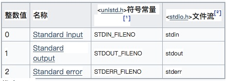

BASH
======
> A script needs read as well as execute permission for it to run, since the shell needs to be able to read it.

> a quoted or escaped `#` in an echo statement does not begin a comment such as `echo $(( 2#101011 ))` - convert binary to decimal
> 
> Terminator in a `case` option [double semicolon] `;;`
> 
> a listing of commands within parenthese starts a subshell. 
> Variables inside parentheses, within the subshell, are not visible o the rest of the script. The parent process, the script, cannot read variable screated in the child process, the subshell. 
> 
> However, varibles in curly braces `{}` are visible to outer commands 
> 
> `command &>filename` redirects both the stdout and the stderr of command to filename
> 
> `$?` represents the the return value of last executed command. 0 represents success 1 represent error
> 
> `command >&2` redirects stdout of command to stderr
> 

> `\<the\>` match the exact word "the"
> 
> A pipe runs as a child process and therefore cannot alter script variables
> 
>  